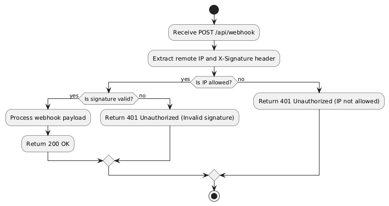

# WebHookPOC

This project is an ASP.NET Core Web API Proof of Concept for secure webhook handling.

## Features
- Secure webhook endpoint (signature validation and IP whitelisting recommended)
- Ready for further customization

## Getting Started
1. Build the project:
   ```powershell  or Terminal
   dotnet build
   ```
2. Run the project:
   ```powershell or Terminal
   dotnet run
   ```
3. The API will be available at `http://localhost:5000` by default. But check your port in running environment.

## Security
- Implement IP whitelisting and HMAC signature validation for webhook endpoints.

## Test Using Postman
* **End point URL** :  http://localhost:5066/api/webhook
* **Method** :  POST
* **X-Signature** :  3C33E88B690C9CDE0D5B8CFC1D914F2B7915C8EB7DDEA4B1FACE6DBECFD535F2
(For Secret = "Ritesh" and  data {
  "example": "data"
})
* **Body** : 
      {
      "event": "BadgePrinted",
      "data": "234567" 
      }

## Activity Diagram



## Next Steps
- Customize the webhook endpoint logic in `Services/WebhookService.cs` .
- Add your IP whitelisting logic
- Add your signature validation logic.

